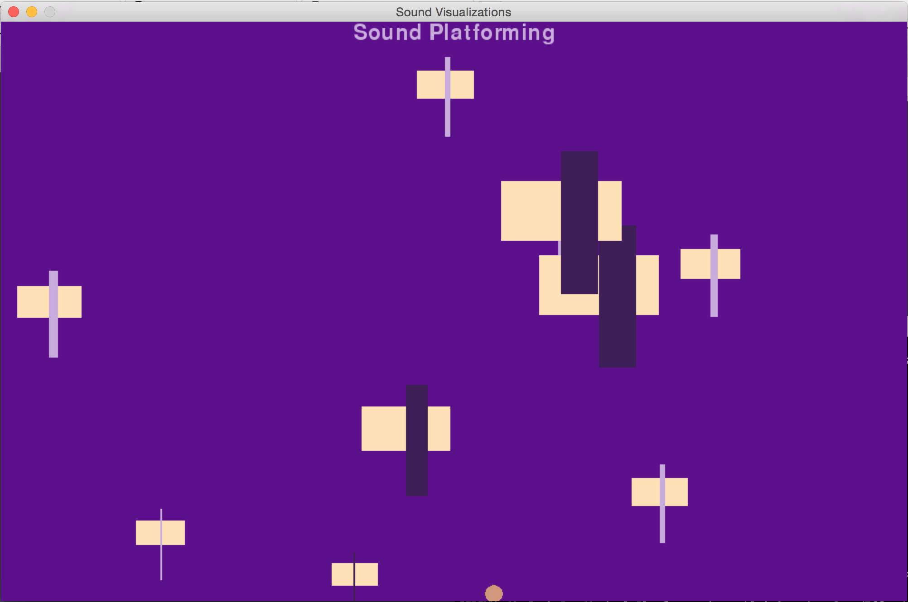

Musical-Platformer
==================

Play music as you jump across platforms

##DEPENDENCIES:
- I am using the pygame library.
- The interpreter must be set to Python 2.x

##PATTERN USE:
+ The Strategy Pattern was  in fading in and out the rectangles and the background when a collision occurs.
By isolating the Fade types in a different class, I was able to rapidly hook up different kinds of fading abilities to my objects.

+ The Visitor Pattern can be seen in the Animates.py file at the bottom. I am using it for collision detection.
The visitor pattern allowed me to detect collisions between two specified objects. Right now, I am telling it to detect collision between a rectangle and the ball. The pattern works well because in the future if I want to
detect collision between say a star and and ellipse, I can just add that to the visitor class. It also seperates messy collision detection code from my shapes classes.

+ The Decorator pattern is used in ID'ing the different beige rectangles with light purple or dark purple vertical
rectangles. This pattern is useful in my program because in the future, when I want to start adding new ID shapes on top of the original rectangles, I can do so with an infinite amount of permutations. (I.e a dark purle rectangle, with a star in the middle, encircled by an ellipse)

+ The State pattern can be seen with my ball. As a fun little visual effect, I wanted the ball to change colors based on whether or not is travelling upwards (state 1), downwards (state 2) or on the floor.

+ While the Observer Pattern is not in this project, I did previously implement it. I had the rectangles move left
and right, but the visual representation of where the rectangles were on the screen was not linked to easily accessible coordinates on the back end. Thus I used the observer pattern to have my back-end representation watch my
front end visual representation of the rectangle moving. Every time the rectangle moved, using the observer pattern, it notified the back-end to update its values.
However, I ultimately decided not to have the rectangles move in my final project so the observer pattern no longer
has a place within my code. (You can see I still have observer.py in my directory. It is not hooked up to anything.
You can just ignore it).

 ##GENERAL THOUGHTS:
 To run this, run SoundEffectLooper.py.
 - Use the arrow keys to move the ball around the screen.
 - Press the spacebar to shuffle the screen
 - The idea is that the platforms with light-purple vertical bars represent musical phrases that you can jump on to play along to the music.
 -The Dark-Purple platforms are sound FX that you can use to accent the music.